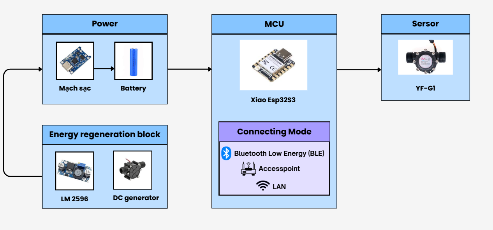

# Firmware_Water_Meter

**Firmware_Water_Meter** is a firmware project designed for ESP32-based water metering. It measures water flow using a flow sensor and sends the data via MQTT. The firmware supports multiple connectivity options (WiFi, BLE, and Access Point mode) and features Over-The-Air (OTA) update capabilities for easy remote 
firmware upgrades.

## Overview of Hardware System

  

## Features

- **Water Flow Measurement**
  - Uses an interrupt-based flow sensor to count pulses.
  - Calculates water flow rate (liters per minute).
  - Aggregates water consumption into a weekly total (`total_water_weekly`).

- **Flexible Connectivity**
  - **WiFi Mode:** Connects to a configured WiFi network and sends data to an MQTT broker.
  - **BLE Mode:** Allows configuration of WiFi credentials via Bluetooth Low Energy.
  - **Access Point (AP) Mode:** Creates a WiFi hotspot for direct configuration through a web interface.

- **MQTT Integration**
  - Publishes water flow data to an MQTT server (e.g., HiveMQ Cloud).
  - Stores data locally on SPIFFS if connectivity issues occur, then transmits once the connection is restored.

- **SPIFFS Storage**
  - Saves WiFi credentials (`/wifi.txt`).
  - Logs water flow data (`/data.log`) for later transmission if needed.

- **Power Management**
  - Enters deep sleep mode if no water flow is detected for 2 minutes to conserve power.

- **OTA Updates**
  - Provides a web interface for performing firmware updates over the air.

## Hardware Requirements

- ESP32-based board (e.g., ESP32 DevKit, Seeed XIAO ESP32S3)
- Flow Sensor (e.g., YF-S201 or similar)
- Additional components for WiFi/BLE connectivity

## Software Setup

1. **Development Environment:**  
   Use PlatformIO or the Arduino IDE to build and upload the firmware.

2. **Required Libraries:**
   - [ESPAsyncWebServer](https://github.com/me-no-dev/ESPAsyncWebServer)
   - [PubSubClient](https://github.com/knolleary/pubsubclient)
   - [WiFiClientSecure](https://www.arduino.cc/en/Reference/WiFiClientSecure)
   - [SPIFFS](https://github.com/espressif/arduino-esp32/tree/master/libraries/SPIFFS)
   - [Update](https://github.com/espressif/arduino-esp32) (for OTA)

3. **Partition Table:**  
   Ensure that your board’s partition scheme allocates enough space for OTA updates and SPIFFS storage.

## OTA Update

To update the firmware over the air:

1. **Connect to the Device:**  
   Either connect to the device’s AP mode network (e.g., `ESP32-AP`) or ensure the device is connected to your local WiFi network.

2. **Access the Update Page:**  
   Open a web browser and navigate to the `/update` endpoint (e.g., `http://192.168.4.1/update`).

3. **Upload the Firmware:**  
   Use the provided form to select your compiled firmware `.bin` file and submit it. The device will perform the update and reboot automatically.

## How It Works

1. **Water Flow Measurement:**  
   An interrupt service routine (ISR) counts the pulses from the flow sensor. Every second, the flow rate is calculated. If the measured flow exceeds a defined threshold, the data is sent via MQTT.

2. **Data Handling:**  
   If WiFi or MQTT connectivity is lost, the measured data is stored in SPIFFS. Once connectivity is re-established, the firmware sends the saved data to the MQTT broker.

3. **Connectivity Modes:**  
   The device initially attempts to connect to WiFi. If unsuccessful, it falls back to BLE or AP modes for reconfiguration.

4. **Power Saving:**  
   In the absence of water flow for a predefined period (2 minutes), the device enters deep sleep mode to conserve power.

## Configuration

- **WiFi Credentials:**  
  WiFi credentials can be set through BLE or via the web interface in AP mode. The credentials are stored in SPIFFS for future use.

- **MQTT Settings:**  
  Update the MQTT server address, port, username, and password in the source code to match your broker configuration.

## Contributing

Contributions and suggestions are welcome! Please fork the repository and create a pull request with your improvements.

## License

This project is licensed under the MIT License. See the [LICENSE](LICENSE) file for details.
